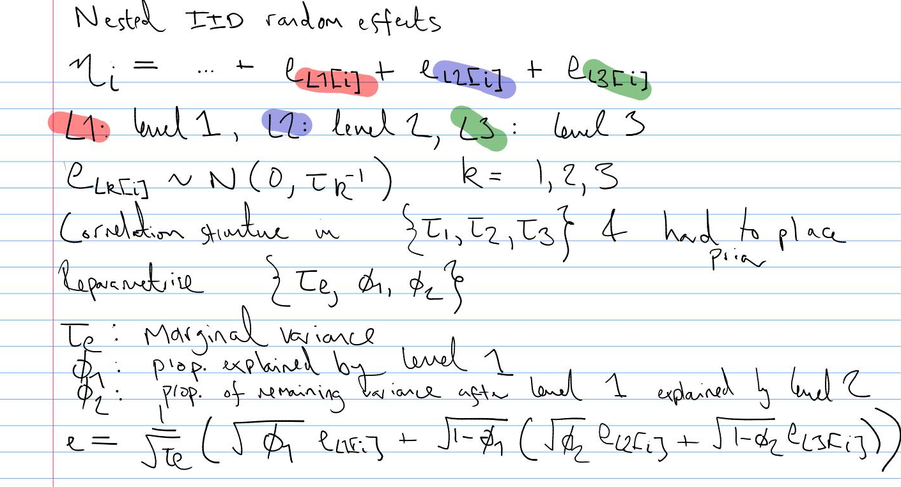

# nested-convolution

This was an idea I had that all random effects should really be like BYM2 ([Simpson *et al.* 2017](https://projecteuclid.org/journals/statistical-science/volume-32/issue-1/Penalising-Model-Component-Complexity--A-Principled-Practical-Approach-to/10.1214/16-STS576.full), [Riebler *et al.* 2016](https://pubmed.ncbi.nlm.nih.gov/27566770/)) random effects.
Specifically, we usually have prior information about the total variance and the proportion of variance attributable to each random effect, not the variance of each individual random effect (especially if there are many).
And so we should place priors on those interpretable quantities.
I also thought that this could increase the orthogonality of the parameterisation, leading to faster e.g. MCMC.

It turns out that [Ingeborg Gullikstad Hem](https://www.ntnu.edu/employees/ingeborg.hem) at NTNU has done a whole PhD thesis on this type of thing!
It was supervised by Geir-Arne Fuglstad and Andrea Riebler, and is titled ["Robustifying Bayesian Hierarchical Models Using Intuitive Prior Elicitation"](https://ntnuopen.ntnu.no/ntnu-xmlui/browse?value=Hem,%20Ingeborg%20Gullikstad&type=author).
A key paper to learn more is [Intuitive Joint Priors for Variance Parameters](https://projecteuclid.org/journals/bayesian-analysis/volume-15/issue-4/Intuitive-Joint-Priors-for-Variance-Parameters/10.1214/19-BA1185.full).
They also have a new R package called [`makemyprior`](https://arxiv.org/abs/2105.09712) that implements these ideas, which works with both `R-INLA` and Stan, which I will definitely be trying out in my work.
